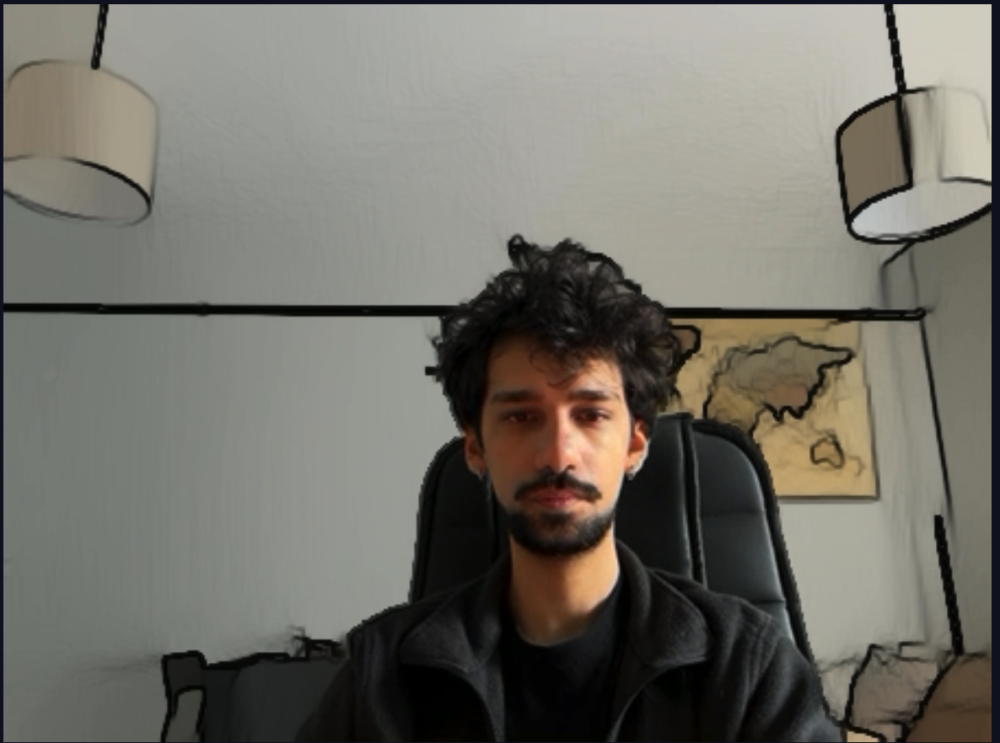
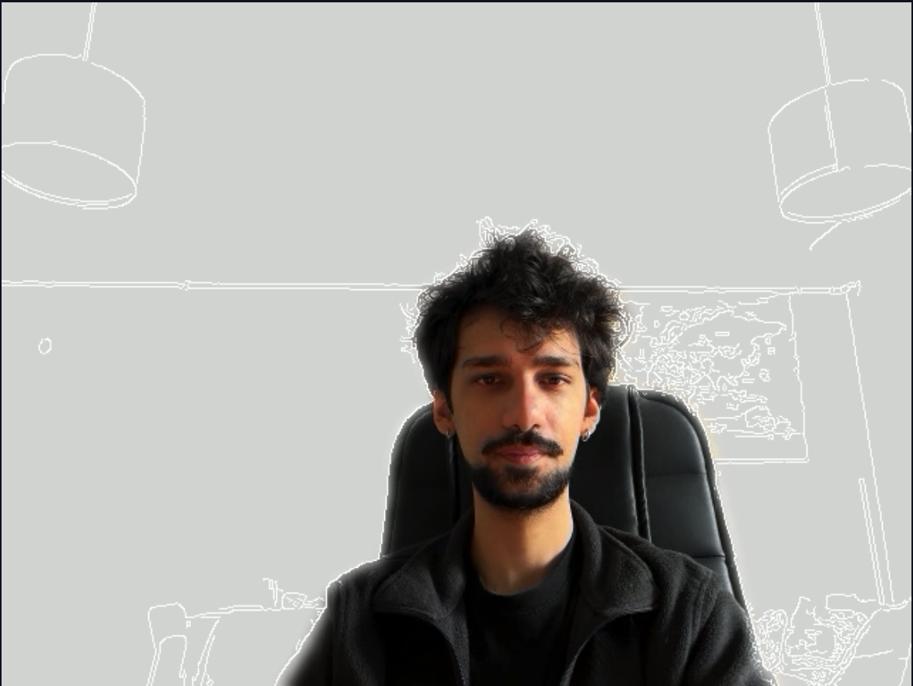
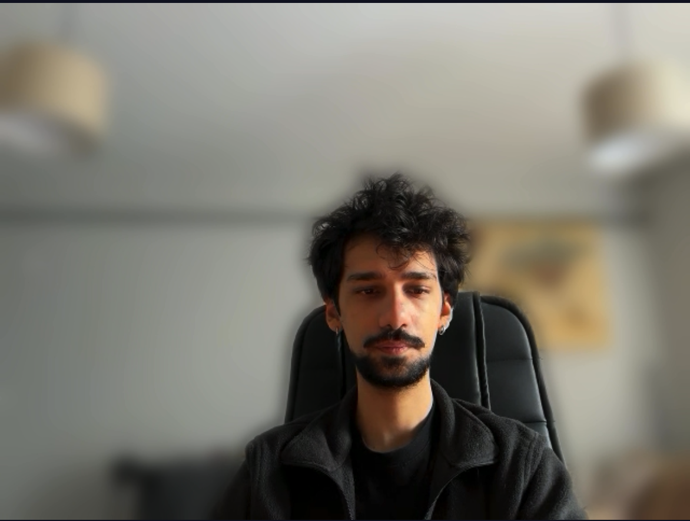

# Realtime Vision Studio

Realtime Vision Studio is a Streamlit-powered stage that segments your webcam feed with MediaPipe, layers ready-made cinematic effects, and helps you capture presentation-grade footage without collecting a custom dataset. The repository ships with curated backgrounds, overlays, and storyboard guidance so you can plug it straight into a portfolio or demo reel.

---

## 📽️ Product Demo

<video src="media/demo.mov" controls playsinline width="720">
  Your browser does not support embedded videos. <a href="media/demo.mov">Download the demo</a>.
</video>

### Spotlight Screens

| Control Panel | Live Stage | Storyboard |
| --- | --- | --- |
|  |  |  |

---

## ✨ Key Features

- **Realtime segmentation** – MediaPipe Selfie Segmentation keeps the subject crisp while the background and overlays respond instantly.
- **Cinematic presets** – Blur, Virtual Stage swaps, Aurora overlays, Duotone portraits, Sketch silhouettes, and Painterly backdrops are all built-in.
- **Live tuning** – Thresholds, edge smoothing, blur radius, overlay intensity, and stylization strength are adjustable while the stream is running.
- **Presentation-first UI** – Hero banner, storyboard expander, and demo playbook copy guide your narration and recording flow.
- **Curated assets** – Neon/pastel backgrounds and light overlays live under `assets/` and can be swapped or extended with your own images.

---

## 🧩 Architecture Overview

1. **Streamlit + streamlit-webrtc** hosts the UI and webRTC pipeline.
2. **MediaPipe Selfie Segmentation** runs on each frame to produce the subject mask.
3. **EffectEngine** (`app/effects.py`) blends the mask with the selected effect (blur, overlays, duotone, etc.).
4. **Realtime feedback** – FPS, effect metadata, storyboard, and demo tips render alongside the live feed.

```text
Camera → streamlit-webrtc → MediaPipe mask → EffectEngine → Styled frame → Streamlit UI
```

---

## 🚀 Getting Started

1. Ensure Python 3.10+ is installed.
2. (Optional) create a virtual environment:
   ```bash
   python3 -m venv .venv
   source .venv/bin/activate  # Windows: .\.venv\Scripts\activate
   ```
3. Install dependencies:
   ```bash
   pip install -r requirements.txt
   ```
   > `mediapipe` and `streamlit-webrtc` may need native dependencies. macOS users can run `brew install ffmpeg portaudio`.

4. Launch the studio:
   ```bash
   streamlit run app/streamlit_app.py
   ```

5. Give the browser camera permission, then press **Start** in the Streamlit widget to begin streaming.

---

## 🎛️ Controls & Effects

| Effect | What it does | Tweaks |
| --- | --- | --- |
| Clean Cut | Keeps the raw feed but applies segmentation for later combinations. | Threshold, smoothing |
| Blurred Background | Gaussian blur on everything but the subject. | Blur strength |
| Virtual Stage | Swaps in a selected background from `assets/backgrounds`. | Background pick, blur fallback |
| Aurora Overlay | Blends light textures over the frame. | Overlay pick & opacity |
| Duotone Portrait | Applies complementary color grading on the subject vs. background. | Palette (hard-coded pastel) |
| Sketch Silhouette | Highlights edges and adds a glow around the subject outline. | Mask smoothing |
| Painterly Backdrop | Stylizes the background using OpenCV stylization; keeps subject sharp. | Stylization strength |

**Sidebar controls** include Segmentation Threshold, Edge Smoothing, Background Blur, Overlay Intensity, and Painterly Backdrop strength. Tooltips in the UI highlight best practices (e.g., `cmd+shift+5` / `Win+Alt+R` for recording).

---

## 🗂️ Assets & Project Structure

```
app/
  effects.py           # EffectEngine logic & helpers
  streamlit_app.py     # UI, WebRTC pipeline, session state
assets/
  backgrounds/         # Neon & pastel backdrops (add your own)
  overlays/            # Aurora overlay textures
media/
  demo.mov             # 1-minute walkthrough
  screenshots/         # Control panel, live stage, storyboard views
.streamlit/config.toml # Theme colors and typography
requirements.txt       # Streamlit, streamlit-webrtc, mediapipe, OpenCV, etc.
```

Drop additional PNG/JPG/PPM files into `assets/backgrounds` or `assets/overlays` and they immediately appear in the Virtual Stage / Overlay pickers.

---

## 🎬 Suggested Demo Script

1. **Opening hook** – Start with `Clean Cut` and introduce the studio.
2. **Backdrop parade** – Switch to `Virtual Stage` and cycle through Neon vs. Pastel looks.
3. **Mood shift** – Jump to `Aurora Overlay`, drag the intensity slider to show live lighting changes.
4. **Artistic finale** – Layer `Painterly Backdrop` with `Duotone Portrait` for a cinematic ending.
5. **CTA moment** – Fade in your portfolio URL or QR code while signing off.

Record directly via OS shortcuts or capture the window in OBS to edit later.

---

## 🛠️ Customization Ideas

- Tweak theme colors in `.streamlit/config.toml` to match brand palettes.
- Add “scene packs” (e.g., Cyberpunk, Cozy Office) by dropping curated backgrounds into the assets folder.
- Combine the module with OBS overlays, captions, or a teleprompter for live streaming.
- Export the webcam feed to Zoom/Meet via virtual camera software for remote presentations.

---

## 🔮 Roadmap Possibilities

1. Integrate ControlNet or Stable Diffusion to generate AI-crafted backdrops from a prompt.
2. Save and recall effect presets for lightning-fast scene changes.
3. Add an MP4 recorder inside the app for one-click exports.
4. Support body/pose detection to trigger effects based on gestures.

---

Enjoy crafting stage-ready visuals!  
If you create your own clips or variations, share a link or screenshots so others can explore new looks. 
